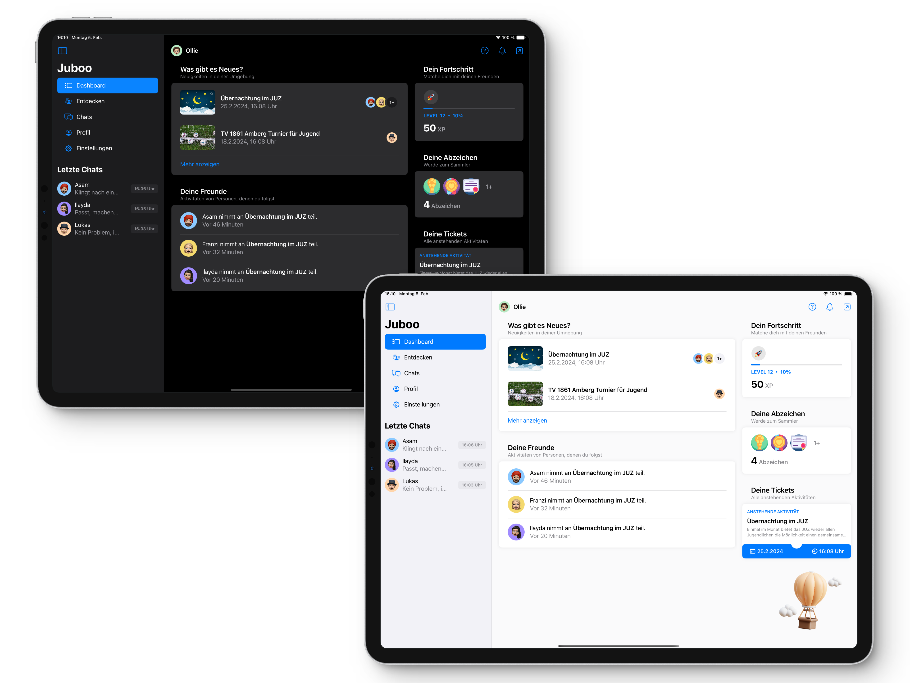
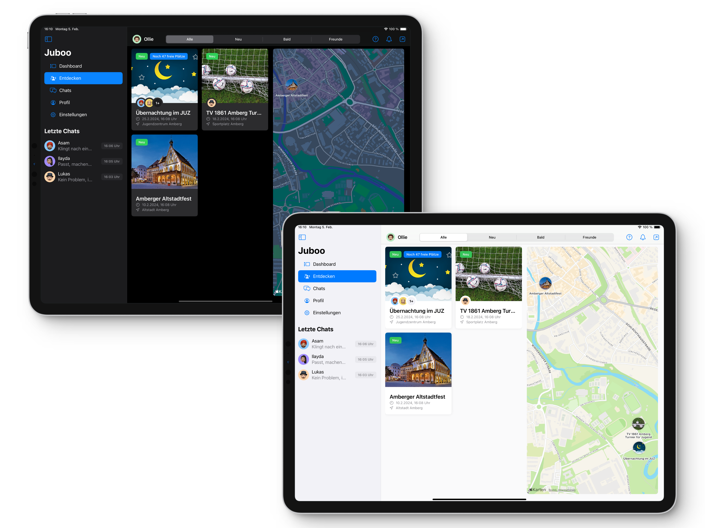
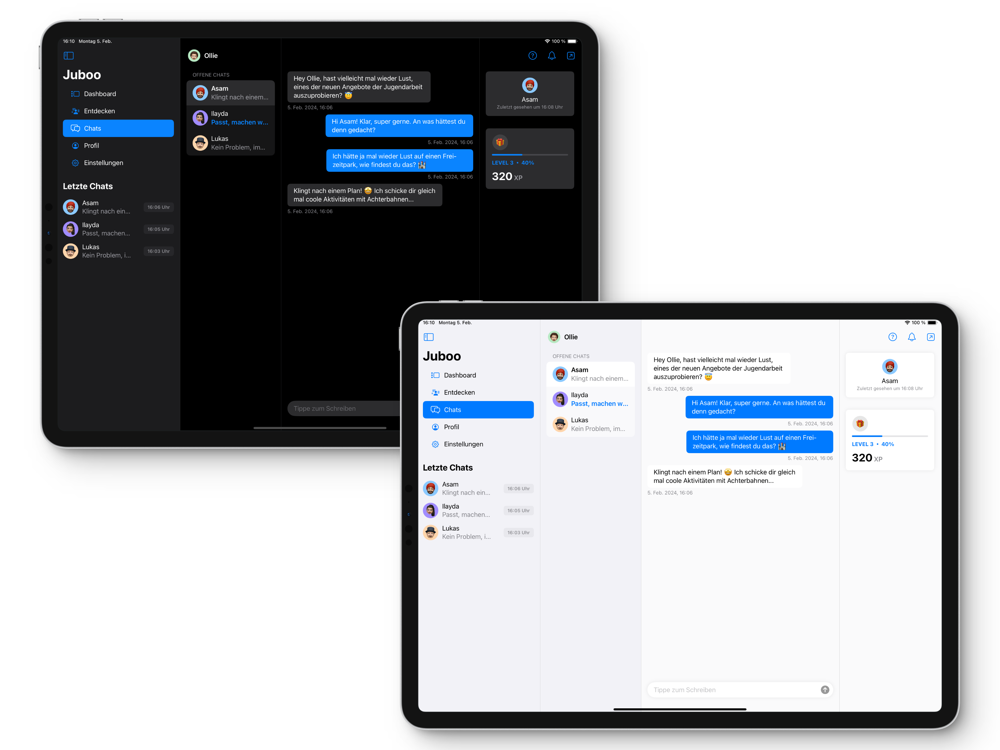
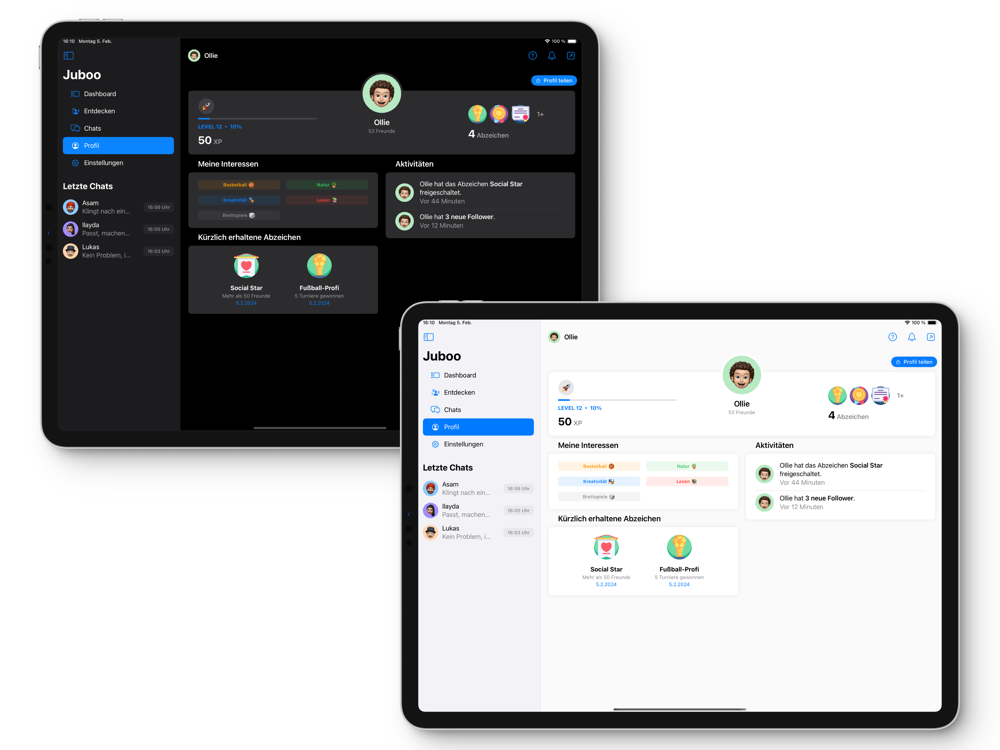
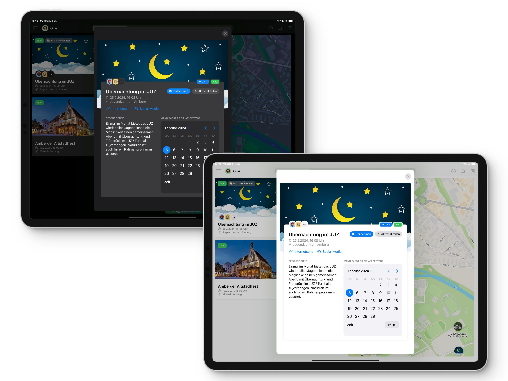
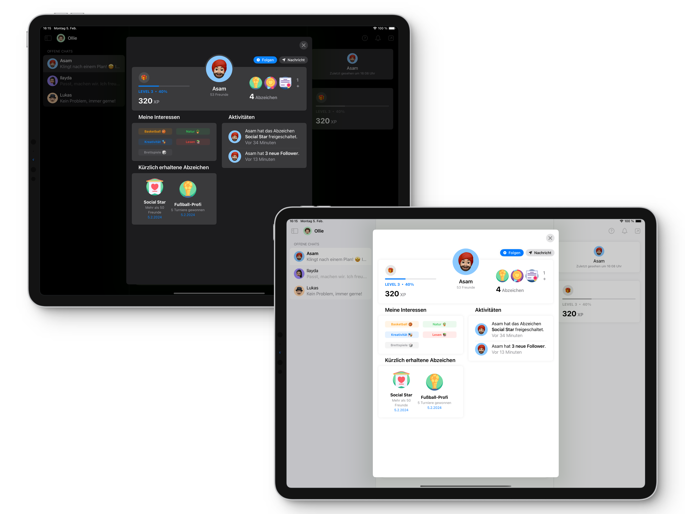

# Projektmodul

`Juboo` ist die Abkürzung für `Jugendarbeit` kombiniert mit `Booster`. Dieser Name ist im Rahmen einer Studienarbeit des Moduls `Innovationsmanagement` von [Prof. Dipl.-Des. Martin Frey](https://www.oth-aw.de/hochschule/ueber-uns/personen/frey-martin/) im Sommersemester 2023 entstanden.

Die Aufgabe war die Entwicklung eines Ansatzes zur **Stärkung der regionalen Jugendarbeit in Amberg**. Dabei haben wir gemeinsam als Team, bestehend aus Ivan Aleksandrov, Kevin Koller, Matthias Schön und Nicolas Proske, die App namens `Juboo` konzeptionell in einem iterativen Design Thinking Prozess (siehe [Miro-Board](https://miro.com/app/board/uXjVM1XFEE4=/)) entworfen.

> "Juboo soll den Mangel an Sichtbarkeit, Motivation und langfristigem Engagement im Bereich Jugendarbeit angehen, indem sie Gamification und interaktive Elemente nutzt, um Jugendliche und junge Erwachsene zu verbinden. Unser Ziel ist es, die App auf Schul-iPads in Amberger Klassenzimmern verpflichtend zu installieren und sie aktiv in sozialen Netzwerken zu bewerben."

Das entstandene Mockup wird nun im Rahmen dieses Projektmoduls, betreut von [Prof. Dr. Dieter Meiller](https://www.oth-aw.de/meiller/prof-dr-dieter-meiller/), realisiert. Aufgrund des Einsatzzweckes auf iPads erfolgt die Umsetzung mit der Programmiersprache `Swift` und der Oberflächenbibliothek `SwiftUI` nativ für Apple Betriebssysteme.

## 🚀 Funktionen
- Einfacher Login über den Schulaccount
- Individuelle In-App-Benachrichtigungen
- Neuigkeiten zu Aktivitäten in der Umgebung
- Neue Aktivitäten finden
- XP für Aktivitäten sammeln und Level aufsteigen
- Abzeichen für besondere Aktivitäten erhalten
- Bevorstehende Aktivitäten in Form von Tickets verwalten
- Mit Freunden chatten und interagieren
- Dunkles, optimiertes Erscheinungsbild
- Teilen von Mitgliedern und Aktivitäten
- ... und vieles mehr!

## 🎨 Design Thinking in Miro

Der [Design Thinking Prozess](https://miro.com/app/board/uXjVM1XFEE4=/?share_link_id=941817612352) war Teil des Moduls `Innovationsmanagement` im Sommersemester 2023 und wurde über mehrere Monate im Team erarbeitet. Zum Aufrufen wird kein Miro Account benötigt.

## 📱 Mockup in Adobe XD

Das klickbare [Mockup](https://xd.adobe.com/view/4d8ec4ff-657c-49f3-a856-52ce24170ff3-18dd/) kann ohne Adobe Account in einem beliebigem Browser geöffnet werden. Die einzelnen Kommentare beschreiben Funktionalitäten und dienen als zusätzliche Erklärung.

## 🕹 Interaktiver Prototyp

Vo­r­aus­set­zung für das Testen des App-Prototyps ist eine korrekte Installation von Xcode. Dieses [`Tutorial`](https://developer.apple.com/de/support/xcode/) hilft, eine Entwicklungsumgebung aufzusetzen.

1. Repository klonen:
`git clone https://git.oth-aw.de/c0e8/projektmodul-juboo.git` in Terminal ausführen

2. Ordner [`00_Code`](00_Code) öffnen

3. Datei [`Juboo.xcodeproj`](00_Code/Juboo.xcodeproj) in Xcode öffnen

## 💻 Voraussetzungen

- iPadOS 17.0+
- Xcode 15.0+

## ⚙️ Technische Implementierung

Bei der Implementierung wurde darauf geachtet, einen sauberen und gut wartbaren Quellcode zu schreiben. Um die Komplexität möglichst gering zu halten, wurde keine externe Schnittstelle zur Speicherung der Daten angebunden. Alle Daten werden App-seitig mit Hilfe von `SwiftData` in einer lokalen SQLite Datenbank auf dem Gerät persistent gespeichert und sind so lange verfügbar, bis die App gelöscht wird. Standardmäßig werden zu Testzwecken beim ersten Start bestimmte Objekte, z. B. [`Mitglieder`](00_Code/Juboo/Models/Member/Member.swift), [`Aktivitäten`](00_Code/Juboo/Models/Activity/Activity.swift) oder [`Chats`](00_Code/Juboo/Models/Chat/Chat.swift) mit Beispieldaten angelegt.

Die Projektstruktur unterteilt sich in [`Views`](00_Code/Juboo/Views/) (Views, wie z. B. [`DashboardView`](00_Code/Juboo/Views/Dashboard/DashboardView.swift)), [`Models`](00_Code/Juboo/Models/) mit dem gesamten Datenmodell und [`Supporting Files`](00_Code/Juboo/Supporting%20Files/) mit Komponenten, die in mehreren Dateien im gesamten Projekt verwendet werden.

Die gesamte App unterstützt zudem ein dunkles, optimiertes Erscheinungsbild. Das Erscheinungsbild wird automatisch an den gewählten Farbmodus des Betriebssystems angepasst. Bei der Umsetzung der dunklen Komponenten wurde darauf geachtet, eine möglichst gute Abstufung zwischen beieinanderliegenden Elementen zu erhalten und gleichzeitig die schwarzen Elemente wirklich in der Farbe Schwarz abzubilden, um bei iPad-Modellen mit Mini-LED-Technologie etwas Strom zu sparen.

Eine ausführliche Dokumentation mit Kommentaren nach `DocC`-Konventionen für alle Klasse und Enumerations ist in Form einer `.doccarchive`-Datei unter [`01_Documentation/Juboo.doccarchive`](01_Documentation/Juboo.doccarchive.zip) zu finden.

## 👾 Sneak Peek

## 📦 Lizenz

Diese Arbeit unterliegt den Bestimmungen einer
[Creative Commons CC BY-NC-SA 4.0 DEED (Namensnennung - Nicht-kommerziell - Weitergabe unter gleichen Bedingungen 4.0 International)](https://creativecommons.org/licenses/by-nc-sa/4.0/deed.de) Lizenz.

This work is licensed under a
[Creative Commons CC BY-NC-SA 4.0 DEED (Attribution-NonCommercial-ShareAlike 4.0 International)](https://creativecommons.org/licenses/by-nc-sa/4.0) license.

